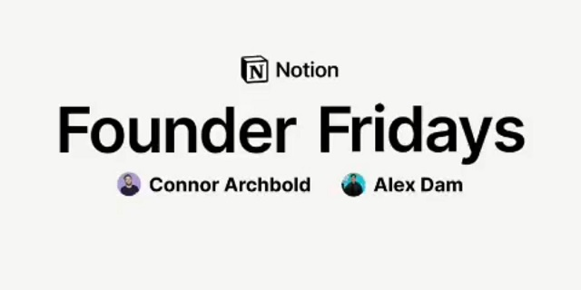

# Cascade

Interactive, Animated, Vanilla Pitch Deck




# Notes

```sh
Cascade
Interactive, Animated, Vanilla Pitch Deck
# Script
Host Intro
Northwind AI
Guest Intro
Binx AI
Relationship
0. Background Profile
Questions Part A ⭐
Halftime (s/o)
Questions Part B ⭐
QNC (s/o)
Advert 🚨
10.Tech/Biz Lessons ✨
Trivia Questions
Salutations
Guest Remarks
Outro
## Part A ⭐
1> Problem Statement __ #How&Why
2Target Audience & Platform __ #Who&Where
3Value Proposition
4Revenue Model
5Funding Strategy
6Go-To-Market Strategy
>
## Part B ⭐
7> Tech Stack & Infrastructure
8Core Modules & Data Model
9✅ Use of AI
❌ Non-functional Requirements (NFR)
- AI/ML*
- Blockchain (Web3)
- Cloud Computing & DevOps
- Cybersecurity
- Data Analytics
>
# Mixer
Header (logo)
Main (background, questions)
Aside (margin, diagrams)
Footer (speakers, banner)
Reset
# Media
Northwind AI
Relationship
Childhood*
Education*
Career*
Website
Advert
Tech Stack*
Data Model*
Hobbies*
Northwind AI Podcast
```
